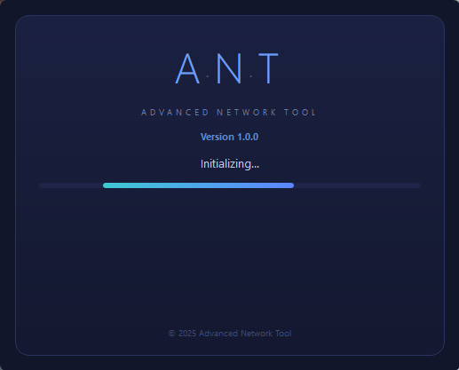
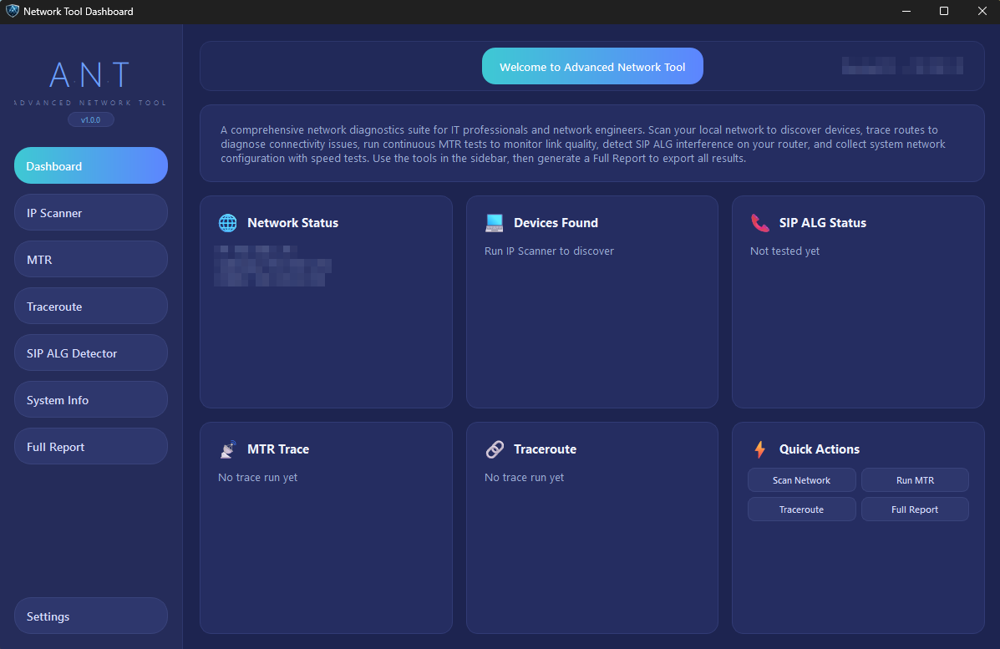
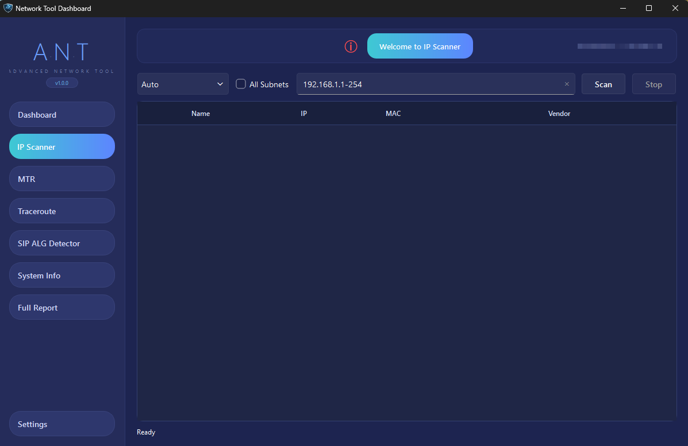
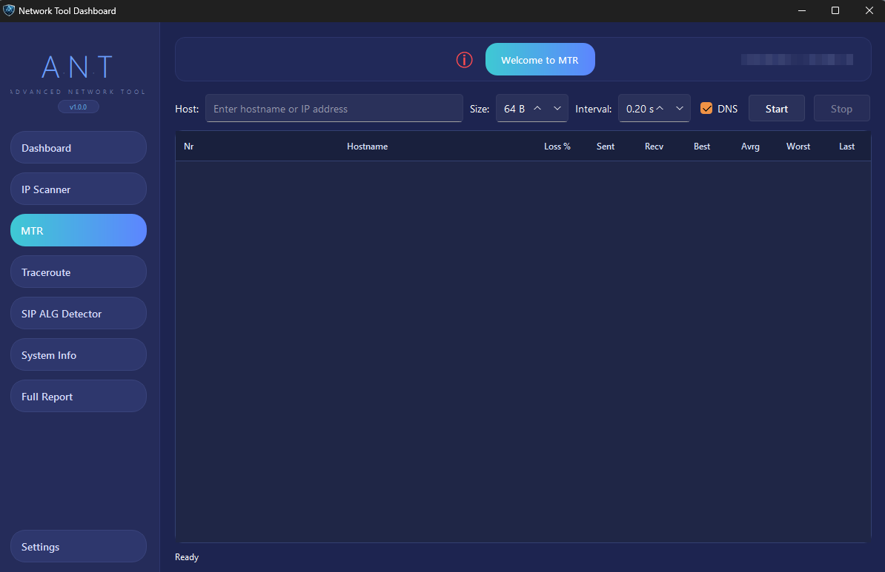
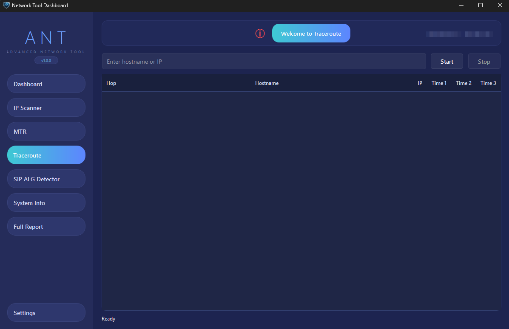
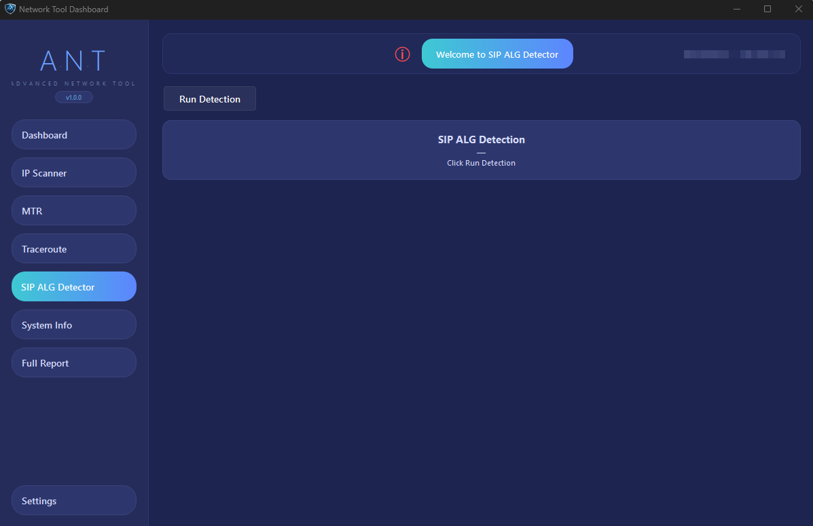
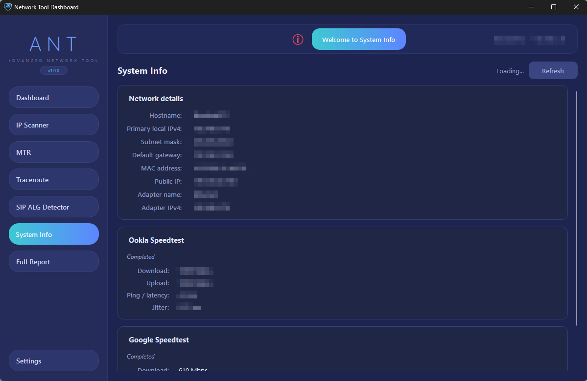
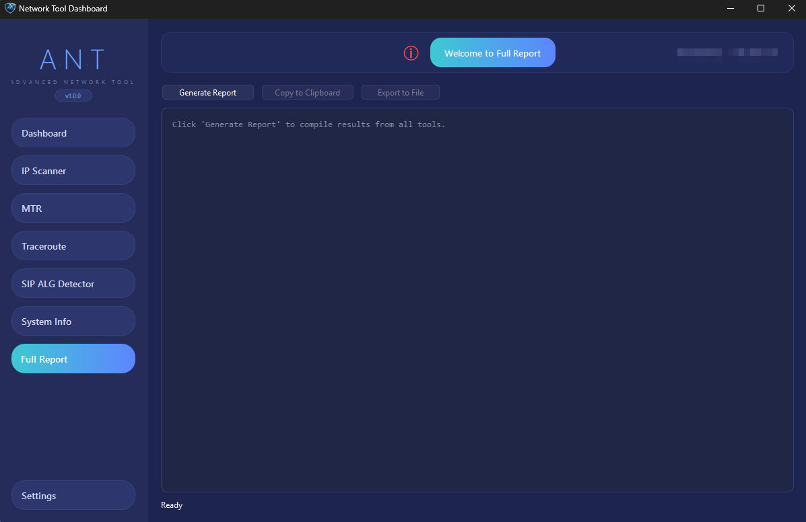
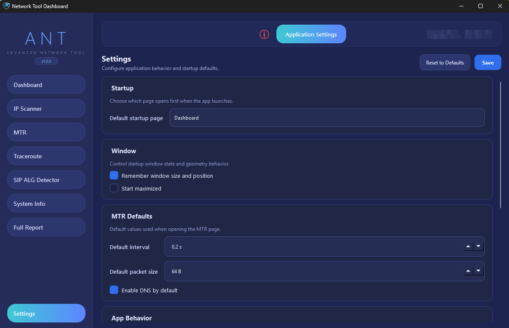

# Advanced Network Tool (A.N.T.)

*A network scanner, traceroute, and diagnostic tool rolled into one.*

Scan Networks. Trace Routes. Troubleshoot problems. Advanced Network Tool does it all.

---

[Features](#features) | [Screenshots](#screenshots) | [Installation](#installation) | [Usage](#usage) | [Privacy](#privacy)

---

ANT will guide you through the tools with accompanying tips.

## Features

| Feature | Description |
|---------|-------------|
| IP Scanner | Locate devices on your network by hostname, IP address, MAC address, and vendor. |
| MTR (My Traceroute) | Persistent traceroute with live latency statistics (Ping + Traceroute in 1 tool) |
| Traceroute | Trace network pathway to any host |
| SIP ALG Detector | Identify if your router is configured with SIP Application Layer Gateway enabled |
| System Info | Application which displays system/network configuration and built-in speedtest |
| Full Report | Generate and export a report with all current data collected by ANT. |
| Settings | Configure ANT to your liking. |

## Screenshots

### Dashboard

*Summary of everything. Network status indicator. Displays total number of detected devices on network. Displays if SIP ALG is detected on network. Tools are accessible via buttons.*

---

### IP Scanner

*A network scanner that will scan all possible devices on your subnet. Detect MAC addresses and device manufacturers.*

---

### MTR (My Traceroute)

*A fusion of ping and traceroute that constantly updates with live latency statistics.*

---

### Traceroute

*Diagnostic tool that traces the route data takes to get to its destination.*

---

### SIP ALG Detector

*Diagnose VoIP and other types of communication failures by identifying if your routers SIP ALG is enabled.*

---

### System Info

*Built-in speedtest. Using Ookla & Google!*

---

### Full Report

*ANT automatically updates the current session report as you go. Click "Generate Report" to export your collected data.*

---

### Settings

*Tweak ANT to your preference.*

---

## Installation

### Microsoft Store

Coming soon to the Microsoft Store! It is undergoing certification.

### Portable

Advanced Network Tool can be installed or run portably.

1. Download the latest zip file from the [Releases](https://github.com/8renn/Advanced-Network-Tool/releases) page.
2. Extract to desired folder.
3. Execute `AdvancedNetworkTool.exe`.
4. Right-click and Run as Administrator for best results. (Some tools require access to raw ICMP sockets)

## Usage

1. Open Advanced Network Tool from Start or by double-clicking the executable.
2. Navigate through the sidebar to access each tool.
3. View active tools on the Dashboard
4. Click each tool to run them independently.
5. Click "Full Report" to export a report containing all current data.

**Note**: Some tools require administrator privileges to function properly. This is due to use of raw ICMP sockets. Right-click Advanced Network Tool and select "Run as Administrator."

---

## Built With

* [Python](https://www.python.org/) - Python code
* [PySide6](https://pyside6.readthedocs.io/) - Qt wrapper and UI creation
* [PyInstaller](https://www.pyinstaller.org/) - Packaging standalone executable
* [MSIX](https://docs.microsoft.com/en-us/windows/msix/) - Microsoft Store Installer Toolkit

## Privacy

ANT does not send, or have the capability to send data over the internet. Your information stays on your computer. The Speedtest connects to Ookla Speedtest Servers which have their own [privacy policy](https://www.speedtest.net/legal/privacy).

[Read Full Privacy Policy](https://8renn.github.io/Privacy-Policy/)

## System Requirements

* **OS** Windows 10/11 (64-bit)
* **RAM** 2 GB+
* **Privileges** Administrator (for raw socket access)

© Copyright 2026 8renn

